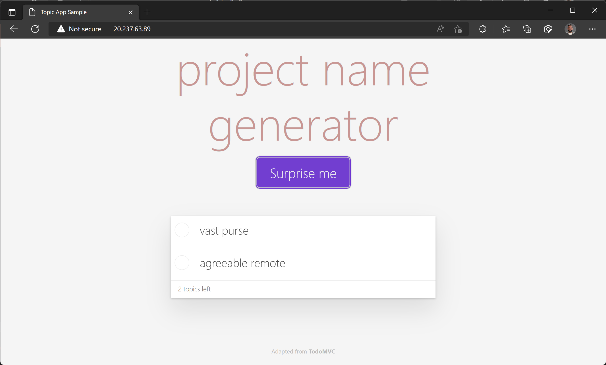

# Contoso project name generator for AKS developer experience demo

This project consists of a [frontend](https://github.com/sabbour/contoso-names-frontend/) written in Node.JS and a [service](https://github.com/sabbour/contoso-names-service) written in C# on top of .NET 6.

## Prerequisites
- Azure subscription
- Domain name to manage using Azure DNS

## Infrastructure setup
- Launch the [Azure Cloud Shell](https://shell.azure.com) and login with your Azure subscription.
- Clone this repository
    ```
    git clone https://github.com/sabbour/contoso-names.git
    ```
- Change into the `contoso-names` directory and run `setup.sh` while providing the required parameters. **Note:** Running this script will provision Azure resources that might incur billing.
    ```
    cd contoso-names
    chmod +x setup.sh
    ./setup.sh
    ```
    
    **Note: ** This will take a few minutes to complete and will provision an Azure Kubernetes Service (AKS) cluster with the recommended add-ons enabled, an Azure Container Registry, an Azure Key Vault with a self-signed certificate, an Azure DNS Zone. The script will also download the cluster's credentials into the cloud shell.

## Deploy the frontend
- Launch the [Azure Cloud Shell](https://shell.azure.com) and login with your Azure subscription.

- Clone the [frontend](https://github.com/sabbour/contoso-names-frontend/) repository.
    ```
    git clone https://github.com/sabbour/contoso-names-frontend.git
    ```

- Change into the `contoso-names-frontend` directory and deploy the Kubernetes manifests.
    ```
    cd contoso-names-frontend
    kubectl create namespace contoso-names
    kubectl apply -f ./manifests --namespace=contoso-names
    ```
- Give it a few minutes and retrieve the Kubernetes service's IP address.
    ```
    kubectl get service contoso-names-frontend --namespace=contoso-names -o jsonpath="{.status.loadBalancer.ingress[0].ip}"
    ```
- Now that you have the service's public IP address, navigate to [http://[contoso-frontend IP address]]() in your browser. The user interface will load but you will receive an error because the backend service hasn't been deployed yet.

    

## Iterate on the service
### Configure GitHub Codespaces
- Open the [service](https://github.com/sabbour/contoso-names-service/) repository with GitHub Codespaces. This will fork the repository under your profile.

    

    GitHub is going to build the codespace and in a few minutes you will be able to access it.

    

### Login and select the Azure subscription

- Install the latest version of the [AKS Developer Tools extension](https://marketplace.visualstudio.com/items?itemName=ms-kubernetes-tools.aks-devx-tools), if it isn't already there.

    

- Launch the command palette (`Ctrl + Shift + P`) and run the `Azure: Sign in with Device Code` command to login to your Azure subscription.

    

- If you have access to multiple tenants, select the one you'd like to use by running the `Azure: Select Tenant` command.

    

- Run the `Azure: Select Subscriptions` command to select the Azure subscription you'd like to use.

    

- Download the AKS cluster configuration on the Kubernetes extension page by clicking the Kubernetes icon on the left, then expand your Azure subscription to find your cluster. Right-click and select **Merge into Kubeconfig** to download the cluster credentials.

    

### Launch the application in GitHub Codespaces
Hit `F5` to run the service in the codespace. This will build and launch the application in the codespace and tunnel the exposed endpoint back to your machine. You should now see the API endpoint.


### Generate Dockerfile
Run the `AKS Developer: Draft a Dockerfile from source code` command.


Provide the following inputs to the command:
- **Source code location:** Select the `/workspaces/contoso-names-service`
- **Programming language:** C#
- **C# version:**  6.0
- **Port:** 80

This will generate an appropriate Dockerfile.


### Build the container image

To build the container image, you can either click the **Build container** button in the notification, or you can also run the `AKS Developer: Build a container with Azure Container Registry` command.

Provide the following inputs to the command:
- **Dockerfile location:** Select the `Dockerfile` file.
- **Tag image as:** `contoso-names-service:latest`
- **Registry provider:**  Connect to an Azure registry, then pick your Azure Container Registry from the list
- **Image base OS:** Linux

This will run a Docker build using Azure Container Registry.


### Create a deployment and service

To deploy to Kubernetes, you need to have Kubernetes manifests for the deployment and service. You can either click the **Draft Kubernetes Deployment and Service** button in the notification, or you can also run the `AKS Developer: Draft a Kubernetes Deployment and Service` command.

Provide the following inputs to the command:
- **Output directory:** `/workspaces/contoso-names-service/manifests`.
- **Format:** Manifests
- **Kubernetes namespace:**  Create a new namespace `contoso-names` and select it
- **Application name:** `contoso-names-service`
- **Image type:** Azure Container Registry
- **Resource group:** Select the resource group of the Azure Container Registry
- **Container registry:** Select the registry that you used to build the image
- **Repository:** Type in the image name `contoso-names-service`
- **Tag:** Type in `latest`
- **Port:** 80

This will generate **deployment.yaml** and **service.yaml** files.


Edit the **service.yaml** file to change the load balancer type to `ClusterIP` since the frontend app will be calling this API over the internal DNS name.


To deploy to Kubernetes, you can either click the **Deploy** button in the notification, or you can also run the `kubectl apply -f ./manifests` in the terminal.


### Review that the frontend app is now working

Using the frontend app's service IP, open that in the browser again and you should see the app is now working.



### Debug with Bridge to Kubernetes

### Create a GitHub Actions workflow

## Configure Web Application Routing on the frontend